# **Flora & Fauna** <!-- omit in toc -->


## **Welcome to Flora & Fauna: Organic Skincare** <!-- omit in toc -->

Embued with the nourishment of nature, our mission at Flora & Fauna is to offer the finest organic ingredients across our entire product range. Our collection of serums, creams, and elixirs will transform your skincare routine into a botanical sanctuary. Explore our garden and discover the perfect blend of nature's best for your skin.

This project was created as part of the Code Institute Level 5 Diploma in Web Application Development course.


[Click here to visit Flora & Fauna](https://flora-and-fauna-c279c1bad929.herokuapp.com/)

**By [Andrew Wright](https://github.com/AndyWright360)**

---

## **Contents** <!-- omit in toc --> 

- [**User Experience (UX)**](#user-experience-ux)
  - [**Initial Concept**](#initial-concept)
  - [**User Stories**](#user-stories)
- [**Design**](#design)
  - [**Colour Scheme**](#colour-scheme)
    - [**Primary Palette**](#primary-palette)
    - [**Seconday Pallette**](#secondary-pallette)
    - [**Additional Colours**](#additional-colours)
  - [**Typography**](#typography)
  - [**Imagery**](#imagery)
  - [**Wireframes**](#wireframes)
    - [**Home Page WF**](#home-page-wf)
    - [**Products Page WF**](#products-page-wf)
    - [**Product Detail Page WF**](#product-detail-page-wf)
    - [**Add Product Page WF**](#add-product-page-wf)
    - [**Edit Product Page WF**](#edit-product-page-wf)
    - [**Bag Page WF**](#bag-page-wf)
    - [**Checkout Page WF**](#checkout-page-wf)
    - [**Checkout Success Page WF**](#checkout-success-page-wf)
    - [**Profile Page WF**](#profile-page-wf)
    - [**Add/Edit Review Page WF**](#addedit-review-page-wf)
  - [**Database Schema**](#database-schema)
    - [**UserProfile**](#userprofile)
    - [**Order**](#order)
    - [**OrderLineItem**](#orderlineitem)
    - [**Range**](#range)
    - [**Product**](#product)
    - [**Review**](#review)
    - [**WishlistItem**](#wishlistitem)
- [**Features**](#features)
  - [**General Features**](#general-features)
  - [**Future Implementations**](#future-implementations)
- [**Technologies Used**](#technologies-used)
  - [**Languages Used**](#languages-used)
  - [**Frameworks, Libraries \& Programs Used**](#frameworks-libraries--programs-used)
- [**Deployment \& Local Development**](#deployment--local-development)
  - [**PostgreSQL Database**](#postgresql-database)
  - [**Amazon AWS**](#amazon-aws)
    - [**Create S3 Bucket**](#create-s3-bucket)
    - [**Set Up IAM**](#set-up-iam)
    - [**Final AWS Setup**](#final-aws-setup)
  - [**Stripe API**](#stripe-api)
  - [**Heroku Deployment**](#heroku-deployment)
  - [**Local Development**](#local-development)
    - [**How to Fork**](#how-to-fork)
    - [**How to Clone**](#how-to-clone)
- [**Testing**](#testing)
- [**Credits**](#credits)
  - [**Code Used**](#code-used)
  - [**Content**](#content)
  - [**Images**](#images)
  - [**Acknowledgments**](#acknowledgments)

---

## **User Experience (UX)**

### **Initial Concept**

From a visual perspective, the design of the website is intended to evoke the beauty of nature. A soft colour palette of greens and blues was chosen to represent earthy and natural tones. The visual design is minimalist and clean, further emphasising the connection to nature. Each product range focuses on a key natural ingredient, prominently featured in the images. By incorporating nature-inspired visuals and a user-friendly interface, my intention is to make navigating the site feel like a walk through a botanical garden.

### **User Stories**

**As A Site User:**

1. I want to understand the purpose of the site immediately upon entering.
2. I want to be able to navigate the site easily and intuitively.
3. I want to use all features on the site on any device.
4. I want to receive feedback when interacting with the site to know if my actions have been successful.

**As A Shopper:**

1. I want to browse products easily, with options to filter and search to find what I need.
2. I want to find detailed information about products.
3. I want to see ratings and reviews of a product to know more about its quality and suitability for me.
4. I want to be able to add multiple products and quantities to my shopping bag.
5. I want to edit my shopping bag if I change my mind.
6. I want to know what I will be charged for delivery.
7. I want the option to purchase products without creating an account.

**As An Account Holder:**

1. I want my account to be secure and easy to set up.
2. I want to see my order history.
3. I want to update and save my personal information.
4. I want to leave reviews of products.
5. I want to edit and delete my reviews.
6. I want to add and remove products from my wishlist.

**As An Administrator:**

1. I want to add and edit products.
2. I want to remove products.
3. I want all admin controls to be simple to find and use.

---

## **Design**

### **Colour Scheme**

#### **Primary Palette**

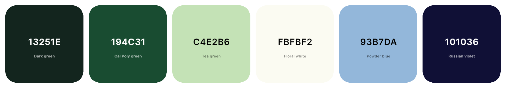

The website's colour scheme is inspired by nature, with shades of green representing plant life and blues symbolising water. This design choice aims to visually connect the brand to the natural world, emphasising its commitment to using organic ingredients. The blend of these colours highlights the brand's dedication to natural elements, reinforcing the message that these elements are integral to the business and its products. 

#### **Secondary Palette**


The secondary palette was designed to visually represent the key ingredients of each of the four product ranges: aloe vera, clear willow, rosehip, and honey. Each product range features a lighter tone as its primary colour to symbolise its respective ingredient, with a contrasting darker shade used for the font to ensure readability.

#### **Additional Colours**


The additional colours were used for delete buttons. The two shades of red serve as a warning to the user before deleting any data.

### **Typography**


Ovo was chosen as the font for the website because of its clean and clear design. Its distinctive decorative ampersand enhances the brand name's visual impact. As a medium contrast serif font, Ovo offers excellent readability and ensures a smooth reading experience for users. Additionally, its use in the logo helps reinforce a connection with the brand's identity.

### **Imagery**

The imagery on the Flora & Fauna website is designed to highlight the brand's natural and organic focus. The website’s colour palette of greens and blues is designed to reflect the beauty of the natural world. Product images incorporate elements related to key ingredients, enhancing the overall connection to nature and emphasising the natural elements in each product. This design approach aims to create a visually cohesive experience that aligns with the brand’s emphasis on natural beauty.

Pairing these design elements with a minimalist style was intended to appeal to a high-end market and highlight the luxurious and indulgent nature of the brand.

### **Wireframes**

Wireframes were created using Balsamiq to cover desktop, tablet, and mobile screen dimensions, ensuring a responsive design. This approach helps in visualising and organising the layout, resulting in a consistent user experience across different devices.

#### **Home Page WF**

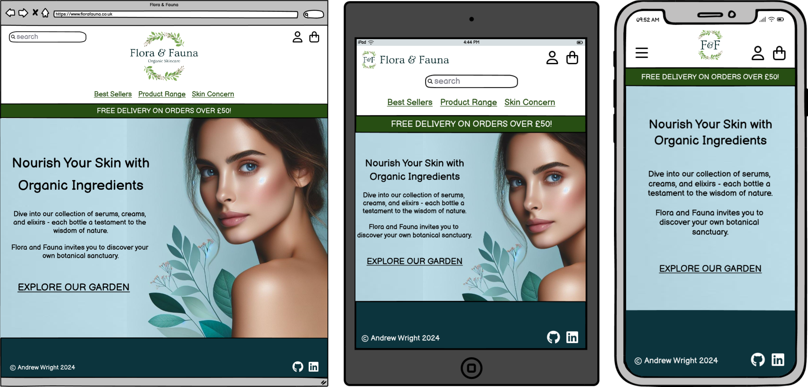

#### **Products Page WF**

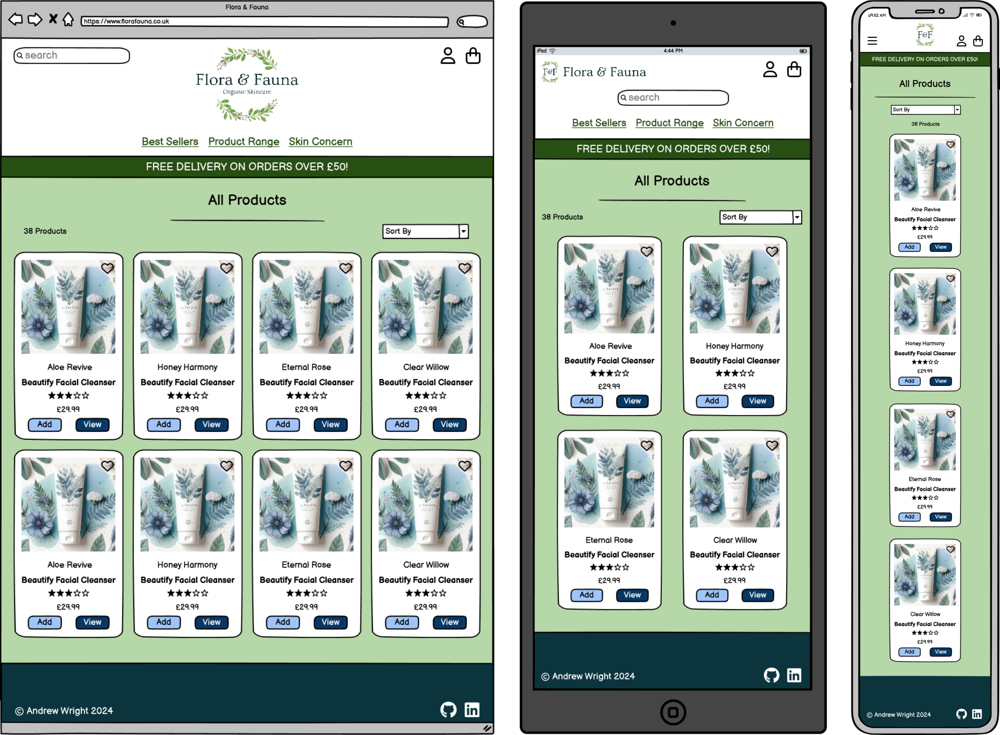

#### **Product Detail Page WF**

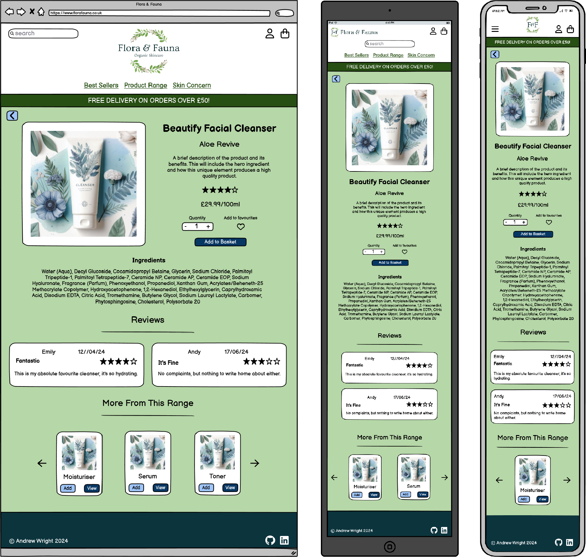

#### **Add Product Page WF**

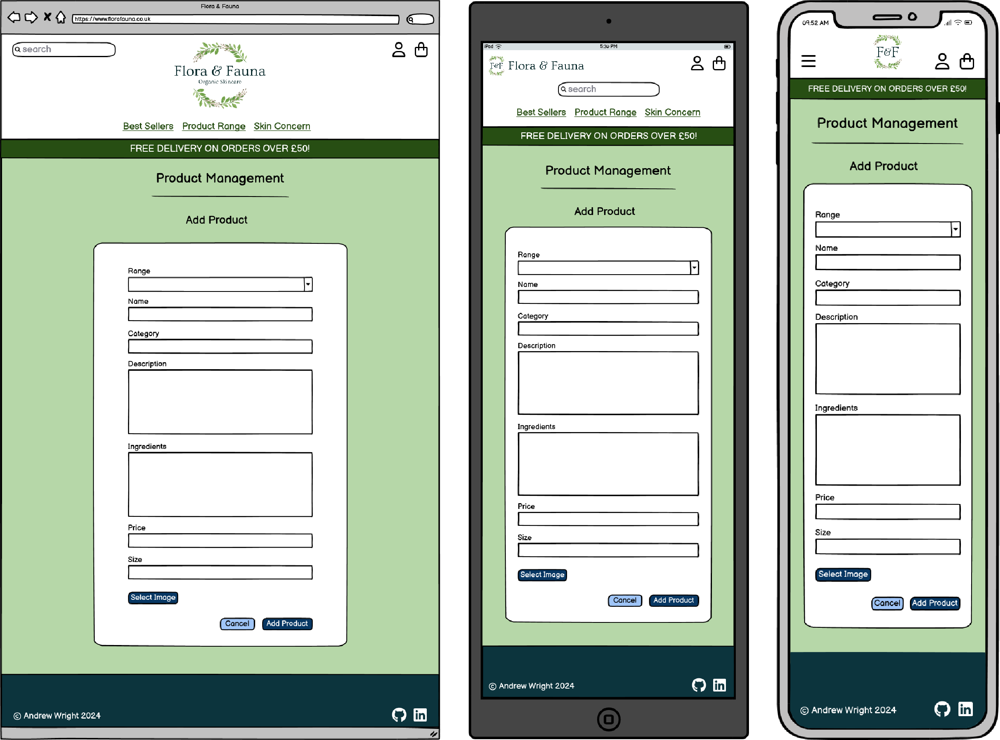

#### **Edit Product Page WF**

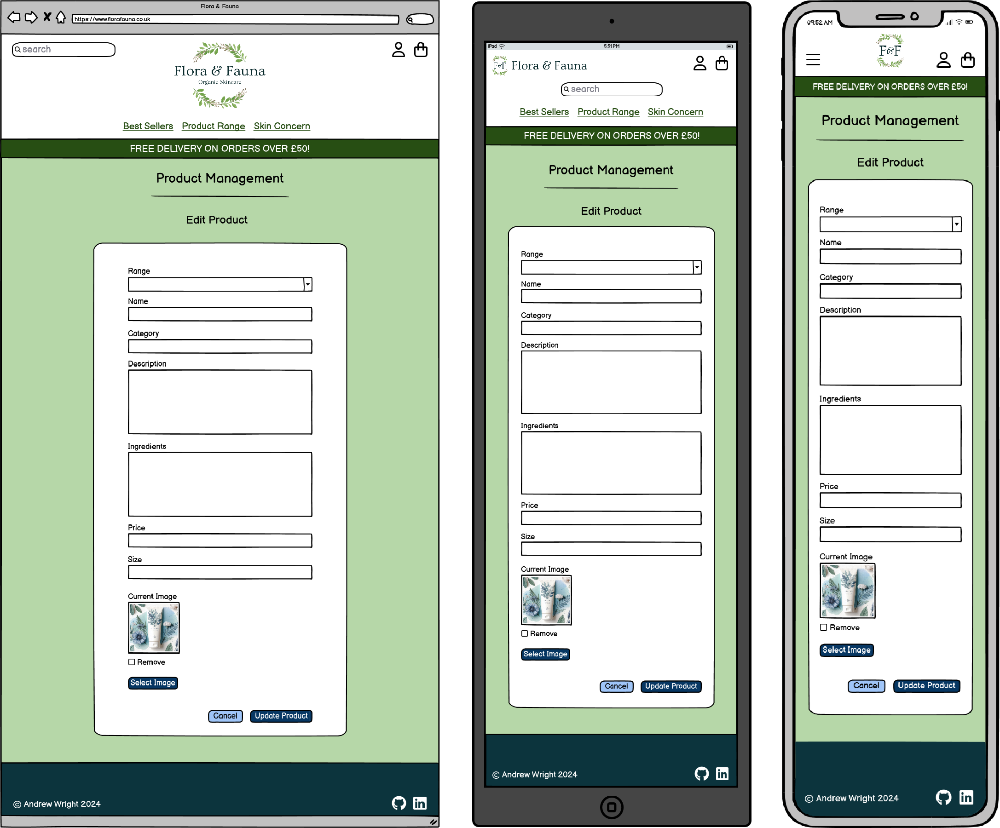

#### **Bag Page WF**

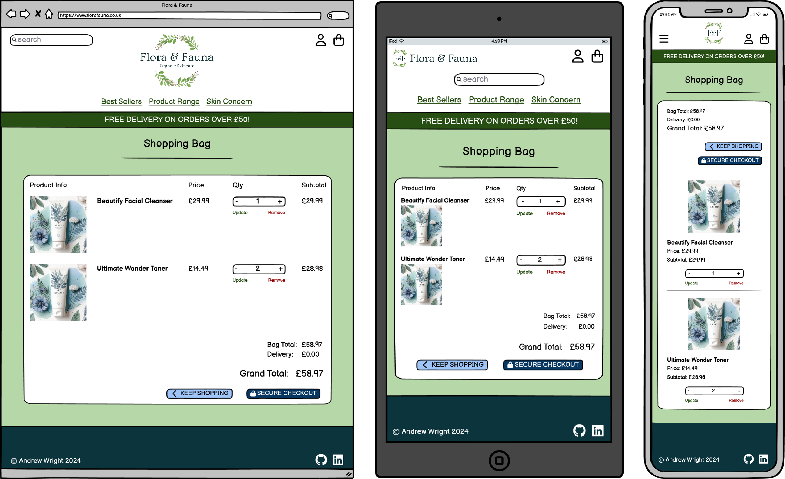

#### **Checkout Page WF**

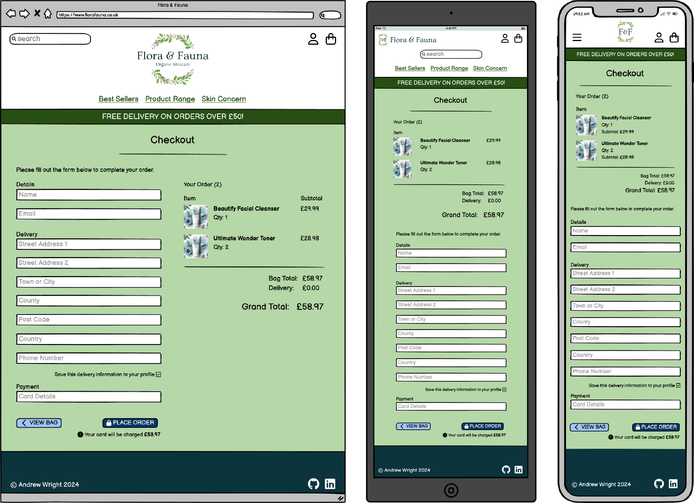

#### **Checkout Success Page WF**

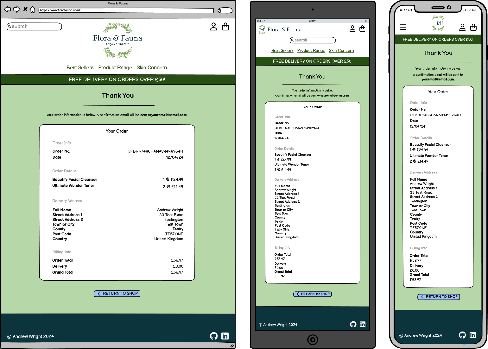

#### **Profile Page WF**


#### **Add/Edit Review Page WF**

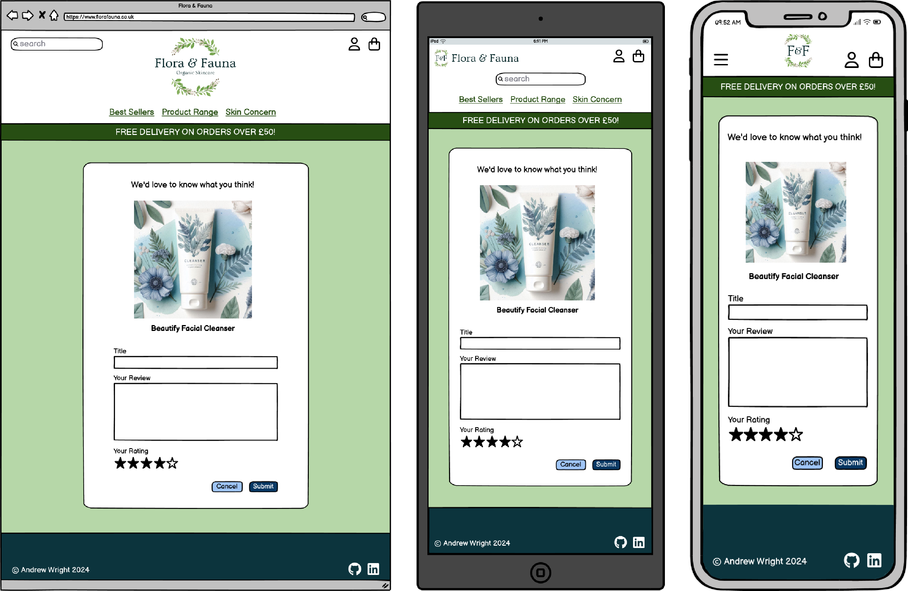

### **Database Schema**

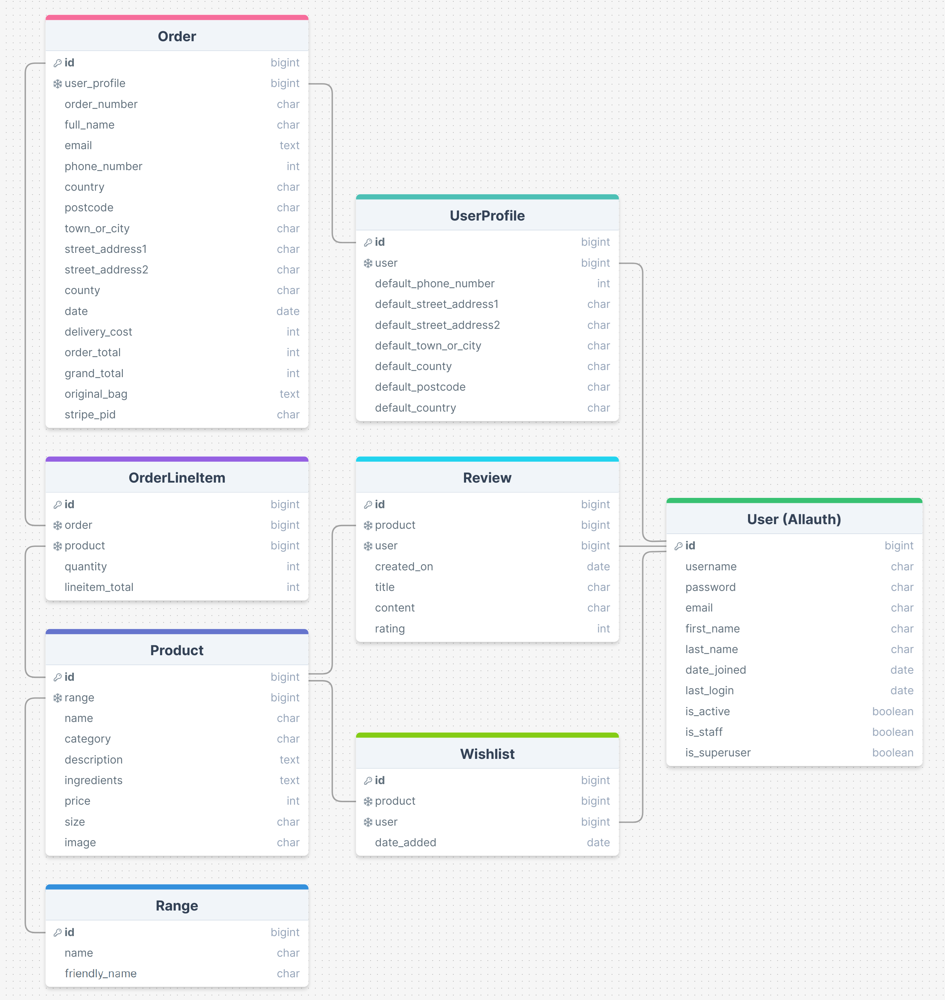

A relational database schema was implemented using PostgreSQL to support the e-commerce functionalities of the Flora & Fauna website. The primary tables are UserProfile, Order, OrderLineItem, Product, Range, Review, and WishlistItem.

These tables are interconnected to enable the management of user profiles, orders, order items, product categories, user reviews, and wishlists. This relational approach maintains reliable data, providing a smooth and consistent user experience across the site.

#### **UserProfile**

The UserProfile model maintains default delivery information and order history for each user. This is linked to the built-in `User` model via a one-to-one relationship, ensuring that each user has a single profile containing their contact details. This setup simplifies the process of retrieving user-specific data for orders and improves the user experience during checkout by pre-filling delivery information.

#### **Order**

This table records individual orders placed by users, storing essential details such as the user profile, contact information, delivery address, and order totals. The `user_profile` field establishes a foreign key relationship with the `UserProfile` model, allowing the system to associate orders with specific users and their profiles.

#### **OrderLineItem**

Each order can consist of multiple products, and this is managed through the OrderLineItem model. It has a foreign key relationship with both the `Order` and `Product` models, enabling a many-to-one relationship with orders and a one-to-one relationship with products within each order. This structure allows the system to track the quantity and total cost of each product in an order.

#### **Range**

The Range model categorises products into different groups based on their key ingredients. This relationship enables users to filter and browse products by specific ranges, enhancing the shopping experience.

#### **Product**

This model stores detailed information about each product available on the site, including its range, name, category, description, ingredients, price, size, and image. The `range` field is a foreign key linked to the `Range` model, which classifies products into specific ranges associated with key ingredients.

#### **Review**

The Review model allows users to leave reviews for products. It includes a foreign key relationship to both the `Product` and `User` models, establishing a connection between users and the products they review. This setup supports a one-to-many relationship where each product can have multiple reviews, and each user can leave multiple reviews.

#### **WishlistItem**

The WishlistItem model enables users to add products to their wishlist. It has foreign key relationships with both the `User` and `Product` models, allowing users to save products they are interested in. The `unique_together` constraint ensures that each product can be added to a user's wishlist only once.

---

## **Features**

### **General Features**

**Responsive Design**

- **Responsive Layout:** The layout adapts to different device widths, ensuring a smooth experience across all devices, improving both accessibility and usability.

**Navbar**

- **Nav Link Hover Effect:** A hover effect on navbar links provides visual feedback, enhancing the interactive experience.

- **Logo Navigation:** The website logo serves as a consistent link to the home page, ensuring easy navigation from any section of the site.

- **Icon Navigation:** Icons for the user account, bag, and search bar (on smaller screens) keep key navigation features accessible even on smaller devices.

- **Search Bar:** Provides a convenient method for users to filter products based on their input.

- **Fixed Position:** The navbar remains fixed, keeping key navigation features always available to the user.

**Favicon**

- **Favicon:** Included to further establish brand identity.

**Delivery Banner**

- **Delivery Threshold Banner:** Notifies users of the minimum spend required for free delivery.

**Back to Top Button**

- **Back to Top Button:** Provides a convenient navigation option on pages with larger vertical height.

**Buttons**

- **Mouse Hover Feedback:** Hovering over buttons alters the border to communicate interactivity.

**Messages**

- **Messages & Feedback:** Messages provide feedback to the use after actions. Indicating task completion or guiding users on how to correct errors.

**Footer**

- **Icon Hover Feedback:** Links include a hover effect, suggesting interactivity and enhancing user engagement.

### **Home Page**

- **Hero Image:** The hero image sets the tone for the website's focus on natural ingredients. It immediately captures attention, highlights the brand's commitment to organic beauty, and invites users to explore further.

- **Introduction:** This provides a brief overview to inform users about the brand's essence and mission.

- **Call to Action Link:** Designed to entice users to explore further, this link directs them to the products page, which is the focal point of the site.

### **Products Page**

- **Product Sorting:** Users can sort products by price, rating, name, range, and category. Allowing them to organise the list of products according to their preferences.

- **Product Filtering:** Users can filter displayed products using the search bar or product category links to meet their specific needs.

- **Product Cards:** Products are displayed on cards that contain all essential product details and functionalities a user might need.

- **Range Links:** Each product is categorised into a range with a colour-specific link, providing a simple navigation option to display all products within the given range.

- **Rating:** Each product's rating is displayed out of five, based on the average rating from user reviews. This offers a visual indicator of other users' opinions.

- **Add Button:** The `ADD` button allows users to quickly add a quantity of 1 to their bag.

- **View Button:** The `VIEW` button navigates users to the product detail page, displaying more information about the given product.

- **Wishlist Button:** Logged-in users can conveniently curate a list of their favourite products with the wishlist button. Once selected, the icon changes to a solid heart, and a notification message is displayed.

- **Edit/Delete Button:** Superusers have the option to edit or delete products, providing a convenient method of product management.

- **Delete Modal:** Clicking the `DELETE` button triggers a modal to confirm the action, providing a failsafe against accidental deletions.

### **Product Detail Page**

- **Additional Product Info:** This page provides detailed information about the product, including its description and list of ingredients, giving users more insight into their selection.

- **Quantity Input:** Users can specify the quantity to add to their bag, within a range of 1 to 99.

- **Increment/Decrement Buttons:** The buttons adjust the quantity within the valid range and are disabled when the minimum or maximum limit is reached.

- **Reviews:** User reviews for the product are displayed, offering feedback and opinions from other customers.

- **Product Range Carousel:** A carousel displays other products from the same range, each with `ADD` and `VIEW` buttons for added convenience.

- **Keep Shopping Button:** Positioned at the top of the page, this button lets users easily return to the products page, enabling them to continue browsing.

### **Shopping Bag Page**

- **Update Quantity:** Each item in the bag includes a number input allowing users to modify the quantity. By changing the quantity and selecting the `Update` button, the product quantity for that line will be adjusted accordingly.

- **Remove Item:** This feature provides a convenient way for users to remove items from their bag. Clicking the `Remove` button will delete the selected order line.

- **Order Summary:** The grand total of the customer's order is displayed, including the bag total, delivery charge if applicable, and the overall grand total. This gives the customer a clear understanding of the total cost.

- **Bag Displayed on Update:** Whenever items are added, updated, or removed from the bag, a display window shows the bag contents along with a message notifying the user of the change made.

### **Checkout Page**

- **Customer Details:** The customer is required to enter their delivery information to proceed with the checkout. Account holders can opt to save these details for a faster checkout process. This form is pre-populated with the saved details if they have previously saved this information.

- **Order Summary:** The order is summarised, including a list of products, the quantities requested, and the total order value. This allows users to quickly check their order before proceeding with payment.

- **Adjust Bag Button:** The `ADJUST BAG` button offers a quick navigation option for users to return to the bag page and make any amendments to their order if required.

- **Loading Overlay:** Once the customer's details and payment method have been validated, a loading overlay is displayed with a rotating icon to provide a visual indicator that the transaction is being processed.

### **Checkout Success Page**

- **Order Summary:** The Checkout Success page provides the user with a full summary of their order. This includes the products ordered, quantities, delivery details, and grand total. A message indicating the email address to which the confirmation has been sent is also displayed at the top of the page.

- **Keep Shopping Button:** The `KEEP SHOPPING` button offers a convenient navigation option to return to the products page.

### **Profile Page**

- **Update Details:** Users can save or update their current delivery information for a more efficient checkout process.

- **Order History:** A list of the customer's previous orders is displayed. Clicking the order number link takes the user to the confirmation success page for that particular order. A message is displayed notifying the customer that the page is showing details from a previously completed order.

- **Reviews:** A list of the customer's current product reviews is displayed, with options to edit or delete each review.

- **Delete Modal:** If the customer opts to delete a review, a modal is displayed to confirm this action as an additional security step.

- **Wishlist:** A carousel of the customer's selected wishlist items can be browsed on this page. Each item contains an `ADD` and `VIEW` button for convenience.

### **Add/Edit Review Page**

- **Review Form:** The form includes an image of the product being reviewed along with its name. It features input fields for the review title, review content, and a customer rating out of 5 stars.

- **Rating System:** The rating system uses star icons that change colour when hovered over and selected, providing interactive feedback. This visual cue helps users easily select and view their chosen rating.

### **Add/Edit Product Page**

- **Product Form:** This page enables SuperUsers to add or modify product details by completing the input fields. These fields include range, name, category, description, ingredients, price, size, and image. If no image is uploaded, a default 'no-image' placeholder will be applied to the product.

- **Remove Image:** When editing a product, the current image is displayed in a small preview. A checkbox option is available to remove this image, allowing users to update or clear the existing product image.

---

## **Technologies Used**

### **Languages**

- **HTML5**
- **CSS3**
- **JavaScript**
- **Python**

### **Frameworks**

- **Bootstrap:** A front-end framework used for developing a responsive layout.
- **Django:** A Python based framework used for backend development.

### **Libraries**

- **jQuery:** A JavaScript library used to simplify writing JavaScript code.
- **Font Awesome:** A toolkit for incorporating icons throughout the site.
- **Google Fonts:** A library of open-source fonts; 'Ovo' is used as the primary typeface throughout the project.

### **Programs**

- **Gitpod:** An online IDE used for development and version control, facilitating the process of committing and pushing changes to GitHub.
- **GitHub:** A platform for version control, serving as the repository for the project's code.
- **Heroku:** A cloud platform that enables the deployment of web applications.
- **Pixlr:** An online photo editing tool used for image modifications, including colour adjustments and resizing.
- **Balsamiq:** A wireframing tool used during the design phase to create mockups of the project.
- **XnConvert:** Image processing software used to convert image files to WebP format.
- **TinyPNG:** An online tool used to compress image files.
- **ScreenToGif:** A screen recording tool used to capture screen recordings as GIF files.
- **Google Chrome Dev Tools:** A set of web developer tools used for inspecting page elements, debugging, and testing responsiveness.
- **PostgreSQL:** An open-source relational database management system used to store data.
- **Am I Responsive?:** A tool to showcase how the website looks across different devices.
- **drawSQL:** A web-based tool used to design and document the database schema.

---

## Deployment & Local Development

The application was deployed on [Heroku](https://www.heroku.com) using the steps below.

### PostgreSQL Database

This project uses a PostgreSQL Database hosted by Code Institute. As an alternative, you can create a free account on [ElephantSQL](https://www.elephantsql.com) using the following steps:

1. Sign up for ElephantSQL using your GitHub account.
2. Click **Create New Instance**.
3. Provide a name (usually the name of your project).
4. Select the **Tiny Turtle (Free)** plan.
5. Leave the **Tags** field blank.
6. Choose the **Region** and **Data Center** closest to you.
7. After creation, click on your new database name to view the database URL and Password.

### Amazon AWS

This project uses AWS for storing media and static files.

#### Create S3 Bucket

1. Log into the AWS Management Console.
2. Search for **S3** and click to create a new bucket.
3. Name the bucket (preferably matching your Heroku app name) and select the closest region.
4. Uncheck **Block all public access** and acknowledge that the bucket will be public.
5. Enable **ACLs** from the **Object Ownership** section, and select **Bucket owner preferred**.
6. Go to the **Properties** tab, enable **Static website hosting**, enter `index.html` and `error.html` in their respective fields, and click **Save**.
7. Navigate to the **Permissions** tab and paste the following CORS configuration:

    ```json
    [
      {
        "AllowedHeaders": ["Authorization"],
        "AllowedMethods": ["GET"],
        "AllowedOrigins": ["*"],
        "ExposeHeaders": []
      }
    ]
    ```

8. Copy your ARN string from the **Bucket Policy** tab.
9. Click on **Policy Generator** and set:

    ```json
    {
      "Version": "2012-10-17",
      "Statement": [
        {
          "Effect": "Allow",
          "Action": [
              "s3:*",
              "s3-object-lambda:*"
          ],
          "Resource": [
            "arn:aws:s3:::your-bucket-name",
            "arn:aws:s3:::your-bucket-name/*"
          ]
        }
      ]
    }
    ```

10. Click **Add Statement** and **Generate Policy**.
11. Copy the entire policy, and paste it into the Bucket Policy Editor. Add `/*` to the end of the Resource key, and click **Save**.
12. In the **Access Control List (ACL)** section, click **Edit**, enable **List** for **Everyone (public access)**, and accept the warning box. If the **Edit** button is disabled, ensure ACLs are enabled in the **Object Ownership** section.

#### Set Up IAM

1. Go to IAM (Identity and Access Management).
2. Click **Create New Group**, name it (e.g., `flora-and-fauna-group`), and proceed to the review policy page.
3. Select the group, go to the **Permissions** tab, and click **Add Permissions**.
4. Choose **Attach Policies**, find and select **AmazonS3FullAccess**, and click **Add Permissions**.
5. In the **JSON** tab, click **Import Managed Policy**, search for S3, select **AmazonS3FullAccess**, and **Import**.
6. Click **Review Policy**, name it (e.g., `flora-and-fauna-policy`), and provide a description:

    ```plaintext
    "Access to S3 Bucket for Flora & Fauna static files."
    ```

7. Click **Create Policy**.
8. Go to the **User Groups** section, select `flora-and-fauna-group`, click **Attach Policy**, search for your newly created policy, and attach it.
9. Click **Add User**, name it (e.g., `flora-and-fauna-user`), select **Programmatic Access**, add it to the `flora-and-fauna-group`, and click **Create User**.
10. Download the `.csv` file containing the Access key ID and Secret access key immediately.
    **NB:** The `.csv` file contains:
      - `AWS_ACCESS_KEY_ID` = Access key ID
      - `AWS_SECRET_ACCESS_KEY` = Secret access key

#### Final AWS Setup

1. Remove `DISABLE_COLLECTSTATIC` from Heroku Config Vars so that AWS handles static files.
2. Create a folder named `media` in S3.
3. Upload any existing media images, ensuring they are publicly readable.

### Stripe API

Stripe handles ecommerce payments.

1. From the Stripe dashboard, access **API Keys** from the **Developers** tab.

    **NB:** The page contains:
      - `STRIPE_PUBLIC_KEY` = Publishable Key
      - `STRIPE_SECRET_KEY` = Secret Key
2. Select the **Webhooks** tab.
3. Click **Add Endpoint**, enter `https://your-heroku-domain/checkout/wh/`, and select **Receive all events**.
4. Click **Add Endpoint** to complete.

    **NB:** The page contains:
      - `STRIPE_WH_SECRET` = Signing Secret Key

### Heroku Deployment

This web application is deployed using Heroku. Follow these steps to recreate the deployment process:

1. Create a requirements.txt file in the root directory, containing all necessary applications and dependencies.
2. Create a Procfile in the root directory, which informs Heroku about the files that run the app and how to run it.

    **NB: Ensure the Procfile has a capital "P" and no file extension.**

3. Check for any blank lines at the end of the file and remove them if present.
4. Save both files, add, commit, and push them to your GitHub repository.
5. Log in to Heroku.
6. Click on the '**New**' button and select '**Create new app**'.
7. Enter a unique name for your app and select a region. Click '**Create app**'.
8. In the deployment section, select GitHub.
9. Connect the correct repository for the project.
10. Go to the '**Settings**' tab, click '**Reveal Config Vars**', and set the following variables:

    | KEY | VALUE |
    | :-- | :-- |
    | AWS_ACCESS_KEY_ID | Your Value |
    | AWS_SECRET_ACCESS_KEY | Your Value |
    | DATABASE_URL | Your Value |
    | DISABLE_COLLECTSTATIC | 1 (To be removed for final deployment) |
    | EMAIL_HOST_PASS | Your Value |
    | EMAIL_HOST_USER | Your Value |
    | SECRET_KEY  | Your Value |
    | STRIPE_PUBLIC_KEY | Your Value |
    | STRIPE_SECRET_KEY | Your Value |
    | STRIPE_WH_SECRET | Your Value |
    | USE_AWS | True |

11. Enable automatic deploys (this step is optional).
12. Within the Manual deploy section. Select the "main" branch from the list of branch options.
13. Click the "Manual Deploy" button.
14. Click "Open app" and the application should open in a new tab.

### **Local Development**

#### **How to Fork**

Forking the GitHub Repository allows for changes to be made without altering the original repository. To do this please follow the following steps:

1. Log in to GitHub.
2. Locate the relevant repository for this project [Flora & Fauna](https://github.com/AndyWright360/Flora-and-Fauna).
3. Select the '**Fork**' button located towards the top right of the repository.
4. You should now have a copy of the original repository in your GitHub account.

#### **How to Clone**

To clone this project, please follow the steps below:

1. Log in to GitHub.
2. Locate the relevant repository for this project [Flora & Fauna](https://github.com/AndyWright360/Flora-and-Fauna).
3. Click on the green '**Code**' drop-down button.
4. Select the '**Local**' tab in the window that appears.
5. Select the option '**HTTPS**' and copy the link shown.
6. Open the terminal in your IDE of choice.
7. Change the current working directory to the location you want to use for the cloned directory.
8. Type '**git clone**' into the terminal and then paste the link you copied in Step 5.

    ```bash
    git clone (relevant link)
    ```

9. Press enter.
10. Set up a virtual environment.

    **NB: If you're using the Code Institute Template in GitPod, you can proceed directly to the next step as the virtual environment is pre-configured for you.**

11. Install the required packages listed in the requirements.txt file by executing the following command in the Terminal.

    ```bash
    pip3 install -r requirements.txt
    ```

12. Create an `env.py` file in the root directory.

    ```python
    import os

    os.environ.setdefault("AWS_ACCESS_KEY_ID", "your_value")
    os.environ.setdefault("AWS_SECRET_ACCESS_KEY", "your_value")
    os.environ.setdefault("DATABASE_URL", "your_value")
    os.environ.setdefault("EMAIL_HOST_PASS", "your_value")
    os.environ.setdefault("EMAIL_HOST_USER", "your_value")
    os.environ.setdefault("SECRET_KEY", "your_value")
    os.environ.setdefault("STRIPE_PUBLIC_KEY", "your_value")
    os.environ.setdefault("STRIPE_SECRET_KEY", "your_value")
    os.environ.setdefault("STRIPE_WH_SECRET", "your_value")

    # Local environment only
    os.environ.setdefault("DEBUG", "True")
    ```

13. Make and apply migrations.

    ```bash
    python3 manage.py makemigrations
    python3 manage.py migrate
    ```

14. Create a superuser.

    ```bash
    python3 manage.py createsuperuser
    ```

15. Load fixtures (if needed).

    ```bash
    python3 manage.py loaddata file-name.json
    ```

16. Run the server.

    ```bash
    python3 manage.py runserver
    ```

---

## **Credits**

### **Code Used**

- The Bootstrap 5 Toasts tutorial by [Sonar Systems](https://www.youtube.com/watch?v=AZs4zggS7kA) provided valuable insights into implementing toast messages for adding and removing products from the wishlist.

- The Add/Remove Wishlist Items using AJAX guide by [Desphixs](https://www.youtube.com/watch?v=pdttUeJi7j8) helped me implement wishlist functionality without having to reload the webpage.

- The Star Rating System by [Madannes](https://jsfiddle.net/madannes/r3s1jx4y/) helped me to modify radio inputs into a star rating system using CSS.

- The [Boutique Ado](https://github.com/Code-Institute-Solutions/boutique_ado_v1/tree/250e2c2b8e43cccb56b4721cd8a8bd4de6686546) project by Code Institute was instrumental in enhancing my understanding of Django and implementing e-commerce website features.

### **Content**

The product descriptions and ingredient lists were generated with the assistance of Microsoft Copilot AI. All other website content was created by the developer, Andrew Wright.

### **Images**

- Company Logo from [Pngtree](https://pngtree.com/freepng/watercolor-wreath-with-green-leaf-circle-frame_5290430.html)

- Heading underline from [Pngtree](https://pngtree.com/freepng/elegant-green-line-border_8053695.html)

- No Product Image from [Freepik](https://www.freepik.com/free-vector/flat-design-no-photo-sign_22631620.htm#&position=0&from_view=user&uuid=ac8a2e42-92fd-472c-97dd-7d97dc715683)

- All product images and the hero image were AI generated using Microsoft Copilot.

### **Acknowledgments**

- Thanks to my mentor [Jubril Akolade](https://github.com/Jubrillionaire) for his consistent encouragement and valuable advice throughout the project.

- Cohort Facilitator [Amy Richardson](https://github.com/amylour) for providing essential resources and support whenever needed.

- Thanks to everyone at Code Institute for their exceptional support.

- The Code Institute Slack community for the invaluable feedback and assistance throughout the project.