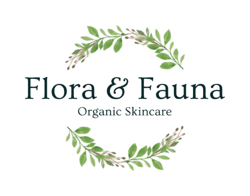

# **Flora & Fauna - Testing** <!-- omit in toc -->

## **Introduction** <!-- omit in toc -->

Welcome to the testing documentation for the Flora & Fauna e-commerce website. This document outlines the testing strategy and practices used to ensure the quality and reliability of the application.

The types of tests performed include automated testing using Django's built-in test suite. Code validation to ensure that the HTML, CSS, JavaScript, and Python code adhere to best practices and standards. Colour contrast checks to verify that the text is easily readable and meets accessibility standards. Additionally, site performance is assessed using Lighthouse testing, and thorough manual tests are conducted to identify and rectify any issues.

The goal of this approach is to deliver the highest quality website achievable within my capabilities.

[The full README is available here.](README.md)

[Click here to visit Flora & Fauna](https://flora-and-fauna-c279c1bad929.herokuapp.com/)

**By [Andrew Wright](https://github.com/AndyWright360)**

---

## **Contents** <!-- omit in toc --> 

- [**Automated Testing**](#automated-testing)
  - [**Django Testing**](#django-testing)
  - [**Code Validation**](#code-validation)
  - [**WCAG Colour Contrast Checker**](#wcag-colour-contrast-checker)
  - [**Lighthouse Testing**](#lighthouse-testing)
- [**Manual Testing**](#manual-testing)
  - [**Testing User Stories**](#testing-user-stories)
  - [**Full Testing**](#full-testing)
  - [**Bugs & Fixes**](#bugs--fixes)
  - [**Known Bugs**](#known-bugs)

---

## **Automated Testing**

### **Django Testing**

This project marked my first experience with automated testing. As a beginner, I kept the tests straightforward to better understand this approach. I achieved 83% coverage across all apps, which I was pleased with given my experience level. The remaining testing was conducted manually.

I aimed to follow a test-driven development (TDD) approach, writing automated tests or manually checking the site functionality after adding new features. This experience highlighted the benefits of automated testing and improved my understanding of the process.

**Django Test Results**

**Total Test Coverage Results**

**Test Coverage Results Per App**

Home App

Products App

Bag App

Checkout App

Profiles App

Reviews App

Wishlist App

