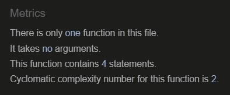
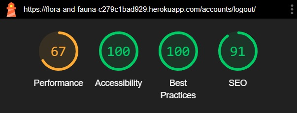

# **Flora & Fauna - Testing** <!-- omit in toc -->

## **Introduction** <!-- omit in toc -->

Welcome to the testing documentation for the Flora & Fauna e-commerce website. This document outlines the testing strategy and practices used to ensure the quality and reliability of the application.

The types of tests performed include automated testing using Django's built-in test suite. Code validation to ensure that the HTML, CSS, JavaScript, and Python code adhere to best practices and standards. Colour contrast checks to verify that the text is easily readable and meets accessibility standards. Additionally, site performance is assessed using Lighthouse testing, and thorough manual tests are conducted to identify and rectify any issues.

The goal of this approach is to deliver the highest quality website achievable within my capabilities.

[The full README is available here.](README.md)

[Click here to visit Flora & Fauna](https://flora-and-fauna-c279c1bad929.herokuapp.com/)

**By [Andrew Wright](https://github.com/AndyWright360)**

---

## **Contents** <!-- omit in toc --> 

- [**Automated Testing**](#automated-testing)
  - [**Django Testing**](#django-testing)
  - [**Code Validation**](#code-validation)
    - [**W3C HTML Validation**](#w3c-html-validation)
    - [**W3C CSS Validation**](#w3c-css-validation)
    - [**JSHint JavaScript Validation**](#jshint-javascript-validation)
    - [**Python Validation**](#python-validation)
  - [**WCAG Colour Contrast Checker**](#wcag-colour-contrast-checker)
  - [**Lighthouse Testing**](#lighthouse-testing)
- [**Manual Testing**](#manual-testing)
  - [**Testing User Stories**](#testing-user-stories)
  - [**Full Testing**](#full-testing)
  - [**Bugs & Fixes**](#bugs--fixes)
  - [**Known Bugs**](#known-bugs)

---

## **Automated Testing**

### **Django Testing**

This project marked my first experience with automated testing. As a beginner, I kept the tests straightforward to better understand this approach. I achieved 83% coverage across all apps, which I was pleased with given my experience level. The remaining testing was conducted manually.

I aimed to follow a test-driven development (TDD) approach, writing automated tests or manually checking the site functionality after adding new features. This experience highlighted the benefits of automated testing and improved my understanding of the process.

**Django Test Results**

**Total Test Coverage Results**

**Test Coverage Results Per App**

Home App

Products App

Bag App

Checkout App

Profiles App

Reviews App

Wishlist App

---

#### **W3C HTML Validation**

[W3C](https://validator.w3.org/) was used to validate the HTML code.

| Page | Results |
| :--- | :--- |
| index.html |  |
| products.html |  |
| product_detail.html |  |
| bag.html |  |
| checkout.html |  |
| checkout_success.html |  |
| profile.html |  |
| add_review.html |  |
| edit_review.html |  |
| add_product.html |  |
| edit_product.html |  |
| signup.html |  |
| login.html |  |
| logout.html |  |

I encountered several warnings while validating my HTML. These included missing `alt` tags for images, `
` elements nested within `` elements, and duplicate `id` tags within the same document. Additionally, there were a few other minor issues that needed correction. Once these problems were addressed, all pages passed validation without any issues.

#### **W3C CSS Validation**

[W3C](https://jigsaw.w3.org/css-validator/) was used to validate the CSS code.

| Page | Results |
| :--- | :--- |
| base.css |  |
| checkout.css |  |

The following warnings were flagged, all related to the use of vendor extensions, which I opted to disregard. I also replaced the deprecated `clip` property with the more commonly used `clip-path`.

#### **JSHint JavaScript Validation**

[JSHint](https://jshint.com/) was used to validate the JavaScript code.

| Page | Results |
| :--- | :--- |
| Quantity Input Script |  |
| Update Bag Script |  |
| New Image Script |  |
| Return To Top Button Script |  |
| Wishlist Toast Script |  |
| Add/Remove Wishlist Item Script |  |
| Product Rage Tooltip Script |  |
| Product Sort Script |  |
| Profile Form Update Script |  |
| Product Review Rating Script |  |
| stripe_elements.js |  |

The only warnings found during JavaScript linting were missing semi-colons. After addressing these, all scripts passed without any issues

#### **Python Validation**

[Code Institute Python Linter](https://pep8ci.herokuapp.com/) was used to validate the Python code.

Main Directory

| Page | Results |
| :--- | :--- |
| `Main` |
| custom_storages.py |  |
| manage.py |  |

Project Directory

| Page | Results |
| :--- | :--- |
| `Flora_and_Fauna` |
| asgi.py |  |
| sttings.py |  |
| urls.py |  |
| wsgi.py |  |

Home App Directory

| Page | Results |
| :--- | :--- |
| `Home` |
| apps.py |  |
| test_views.py |  |
| urls.py |  |
| views.py |  |

Products App Directory

| Page | Results |
| :--- | :--- |
| `Products` |
| admin.py |  |
| apps.py |  |
| forms.py |  |
| models.py |  |
| test_forms.py |  |
| test_models.py |  |
| test_views.py |  |
| urls.py |  |
| views.py |  |
| widgets.py |  |

Bag App Directory

| Page | Results |
| :--- | :--- |
| `Bag` |
| bag_tools.py |  |
| apps.py |  |
| contexts.py |  |
| test_views.py |  |
| urls.py |  |
| views.py |  |

Checkout App Directory

| Page | Results |
| :--- | :--- |
| `Checkout` |
| admin.py |  |
| apps.py |  |
| forms.py |  |
| models.py |  |
| signals.py |  |
| test_forms.py |  |
| test_models.py |  |
| test_views.py |  |
| urls.py |  |
| views.py |  |
| webhook_handler.py |  |
| webhooks.py |  |

Profiles App Directory

| Page | Results |
| :--- | :--- |
| `Profiles` |
| apps.py |  |
| forms.py |  |
| models.py |  |
| test_forms.py |  |
| test_models.py |  |
| test_views.py |  |
| urls.py |  |
| views.py |  |

Reviews App Directory

| Page | Results |
| :--- | :--- |
| `Reviews` |
| admin.py |  |
| apps.py |  |
| forms.py |  |
| models.py |  |
| test_forms.py |  |
| test_models.py |  |
| test_views.py |  |
| urls.py |  |
| views.py |  |

Wishlist App Directory

| Page | Results |
| :--- | :--- |
| `Wishlist` |
| admin.py |  |
| apps.py |  |
| models.py |  |
| test_models.py |  |
| test_views.py |  |
| urls.py |  |
| views.py |  |

 
I needed to make several adjustments to align my code with PEP8 standards. These changes mainly involved reformatting, such as shortening line lengths and eliminating excess white space. Once these modifications were applied, all pages passed without error.

---

### **WCAG Colour Contrast Checker**

A significant effort was made to create a strong contrast in the website's colour scheme. When selecting the primary colours for the site, I ensured that the complementary colours used for the text would also maintain clarity to enhance the user experience.

**Navbar**

The chosen colour scheme serves as the primary theme for the navbar. A high contrast was selected to ensure users have maximum clarity when navigating the site and utilising the various product filtering features.

**Buttons**

The green contrast acts as one of the primary button colours for the site and as the main colour scheme throughout. The blue colour scheme serves as an alternative styling option, while the red button is used specifically for delete options in user reviews and modals.

**Input Fields**

The colour scheme for input fields was chosen for its high contrast to ensure readability and clarity when users input details on the site.

**Product Range Links**

Each product range is represented by a colour associated with its key ingredient. I ensured the contrast was high enough to be legible while effectively communicating the desired colour scheme.

**Footer**

The footer's colour scheme was selected to be distinct while maintaining consistency with the rest of the site. Similar to the navbar, a high contrast was prioritised to ensure it stands out clearly.

---

### **Lighthouse Testing**

Lighthouse within Chrome Developer Tools was used to assess the website's performance, accessibility, adherence to best practices, and SEO.

| Page | Desktop Results | Mobile Results |
| :--- | :--- | :--- |
| index.html |  |  |
| products.html |  |  |
| product_detail.html |  |  |
| bag.html |  |  |
| checkout.html |  |  |
| checkout_success.html |  |  |
| profile.html |  |  |
| add_review.html |  |  |
| edit_review.html |  |  |
| add_product.html |  |  |
| edit_product.html |  |  |
| signup.html |  |  |
| login.html |  |  |
| logout.html |  |  |

---

## **Manual Testing**

### **Testing User Stories**

**Site User**

| Goals | How are they achieved? | Images |
| :--- | :--- | :--- |
| I want to understand the purpose of the site immediately upon entering. | The landing page of the website was designed to immediately convey to users that this is a skincare e-commerce site. This is achieved primarily through the use of a hero image that visually represents the brand. Additionally, a brief introduction clearly outlines the website's purpose and entices users to explore the product range |  |
| I want to be able to navigate the site easily and intuitively. | The primary form of navigation is the navbar, which not only facilitates site navigation but also allows users to search and sort products. By keeping the navbar fixed at the top of the page, users always have quick access to these options. Additionally, various navigation options are available through the use of buttons, offering an extra layer of convenient and informative links throughout the site. |   |
| I want to use all features on the site on any device. | Each page of the website has been thoroughly tested to ensure a responsive layout across various screen sizes. A maximum width of 1600px is applied to the body to maintain visual consistency on wider screens, and the design adapts seamlessly down to 320px. This ensures the website remains visually appealing and functional across a wide range of devices. |   |
| I want to receive feedback when interacting with the site to know if my actions have been successful. | Toast messages are utilised to provide users with feedback when they interact with the site. Success messages confirm actions such as adding a product to the bag. Error messages notify users of any invalid input information. Additionally, info messages offer details, such as indicating which product is currently being edited. |  |

**Shopper**

| Goals | How are they achieved? | Images |
| :--- | :--- | :--- |
| I want to browse products easily, with options to filter and search to find what I need. | The navbar includes a search bar that displays products whose names or descriptions match the search term provided. Displayed products can also be sorted using the options within the navbar or by selecting a sorting option from the dropdown menu on the products page. |  |
| I want to find detailed information about products. | Each product on the products page features a `VIEW` button. Clicking this button takes users to the product detail page, where they can access additional information about the product. This includes the product description, a list of ingredients, and any submitted reviews from other users. |  |
| I want to see ratings and reviews of a product to know more about its quality and suitability for me. | Users with an account can submit reviews for products. Each review includes a title, a message, and a star rating out of five. The product shows an average rating calculated from all submitted reviews. This feature helps users make more informed purchasing decisions by providing valuable customer feedback. |  |
| I want to be able to add multiple products and quantities to my shopping bag. | On the product detail page, users can specify the quantity of a product they wish to add to their bag using the quantity input field. The bag can hold multiple different products, allowing users to select and add a variety of items according to their preferences. |  |
| I want to edit my shopping bag if I change my mind. | The shopping bag page enables users to adjust the quantity of items or remove them from their bag. Each item features `Update` and `Remove` buttons for these actions. |  |
| I want to know what I will be charged for delivery. | Each time a user adds an item to their bag, a message displays the additional amount needed to qualify for free delivery. The bag page provides a detailed breakdown of the order cost, including the `Bag Total`, `Delivery Cost`, and `Grand Total`. This ensures the user is fully aware of the cost before proceeding to checkout.  |  |
| I want the option to purchase products without creating an account. | Users can purchase products without creating an account. However, creating an account offers additional features, such as a profile page to save contact details, the ability to submit product reviews, and the option to add products to a Wishlist. |  |

**Account Holder**

| Goals | How are they achieved? | Images |
| :--- | :--- | :--- |
| I want my account to be secure and easy to set up. | User account creation and security are managed by the Allauth package. This provides users with a robust and secure account system that is feature-rich and far more secure than any system I could create independently. |  |
| I want to see my order history. | From their profile page, users can view a list of their previous orders. Each order number acts as a link that directs the user to a summary of the order, including the products ordered, delivery information, and total cost. |  |
| I want to update and save my personal information. | The form on the profile page allows users to update and save their delivery information. This information will prepopulate the checkout form during their next purchase, ensuring a faster and more convenient checkout process. |  |
| I want to leave reviews of products. | After creating an account, users can submit product reviews from the product details page. This allows them to share feedback and opinions about the product with other users. |  |
| I want to edit and delete my reviews. | A list of the user’s submitted reviews is displayed on their profile page. From there, the user can also edit or delete a review. |  |
| I want to add and remove products from my Wishlist. | For logged-in users, each product card contains a Wishlist button. This provides a quick and convenient way to add any product to their Wishlist. A notification is displayed on screen to inform the user if a product has been added to or removed from their Wishlist. The button icon also changes to a solid heart as a visual reminder of which products are currently in their Wishlist. The products in the user’s Wishlist are displayed on their profile page. |  |

**Administrator**

| Goals | How are they achieved? | Images |
| :--- | :--- | :--- |
| I want to add and edit products. | As an administrator, you have special privileges related to product management. From the user icon in the navbar, you can access the `Product Management` page, where you can add new products to the site. Additionally, each product listing includes `Edit` and `Delete` buttons. These buttons enable you to modify product details or remove products entirely. |  |
| I want to remove products. | When an administrator selects the Delete button for a product, they are prompted to confirm the deletion. This extra confirmation step adds an additional layer of security, helping to prevent accidental deletions. Once confirmed, all details of the selected product are permanently removed from the database. |  |
| I want all admin controls to be simple to find and use. | Each product features `Edit` and `Delete` buttons for straightforward management. The option to add a product is accessible via the user icon in the fixed navbar, ensuring it's conveniently available from any page on the site. |  |

---

### **Full Testing**

Full testing was performed on the following devices:

- Laptop:
  - MSI Thin GF63 15-inch screen
- Mobile Device:
  - iPhone XR

The following browsers were tested using each device:

- Laptop:
  - Google Chrome
  - Mozilla Firefox
- Mobile:
  - Safari

Friends and family also tested the website using a variety of devices. No issues were reported.

| Feature | Expected Outcome | Testing Performed  | Pass/Fail |
| :--- | :--- | :--- | :--- |
| `Navbar` |
| Max Width | Ensure elements display correctly up to 1600px width | View page using Chrome Dev Tools and expand the width beyond 1600px | Pass |
| Min Width | Verify all elements adjust properly to 320px width without distortion | View page using Chrome Dev Tools and reduce the width to 320px | Pass |
| Logo Link | Clicking the logo should navigate to the Home page | Click the logo | Pass |
| Hover Effect | Navigation links and icons should become bold when hovered over | Hover over the navigation links and icons | Pass |
| Navigation Menus | Verify clicking navigation links and the 'Account' icon opens respective options | Click on each navigation link and the 'Account' icon | Pass |
| Navigation Menu Hover Effect | Ensure hovering over a navigation link highlights the option | Open each navigation dropdown menu and hover over each option | Pass |
| Search Bar Focus | The search bar border should indicate focus when clicked inside | Click inside the search bar input | Pass |
| Search Icon Hover Effect | Hovering over the search bar button icon should trigger its hover state | Hover the mouse over the search bar button icon | Pass |
| Bag Total | The Bag icon should display the correct current total value when products are added or removed | Add and remove products from the bag and verify the displayed value | Pass |
| Navigation Links | Ensure each navigation link correctly loads its respective page | Click each navigation link to verify the relevant page loads | Pass |
| Search 'Empty Input' | A toast message should notify the user when attempting to search without entering any criteria | Click the search button with an empty input | Pass |
| Search 'No Results' | No products should be displayed when searching for a keyword that doesn't match any product | Search for a keyword not found in any product | Pass |
| Search 'Results' | Only products matching the search term should be displayed | Search for a keyword that matches some products | Pass |
| Side Nav Expansion | Clicking the side nav button should expand and reveal navigation options | Click the side nav button | Pass |
| Fixed Navbar | When scrolling down the page, ensure the navbar remains fixed at the top of the screen | Scroll down the page | Pass |
| `Footer` |
| Max Width | Ensure elements display correctly up to 1600px width | View page using Chrome Dev Tools and expand the width beyond 1600px | Pass |
| Min Width | Verify all elements adjust properly to 320px width without distortion | View page using Chrome Dev Tools and reduce the width to 320px | Pass |
| Hover Effect | Icons should change colour when hovered over | Hover over the footer icons | Pass |
| Navigation Links | Clicking footer icons should open the respective link in a new window | Click each footer icon | Pass |
| `Home Page` |
| Max Width | Ensure elements display correctly up to 1600px width | View page using Chrome Dev Tools and expand the width beyond 1600px | Pass |
| Min Width | Verify all elements adjust properly to 320px width without distortion | View page using Chrome Dev Tools and reduce the width to 320px | Pass |
| Hover Effect | 'Explore Our Garden!' link should change style when hovered over | Hover over the 'Explore Our Garden!' link | Pass |
| Navigation Link | Clicking the 'Explore Our Garden!' link should navigate to the products page | Click the 'Explore Our Garden!' link | Pass |
| `Products Page` |
| Max Width | Ensure elements display correctly up to 1600px width | View page using Chrome Dev Tools and expand the width beyond 1600px | Pass |
| Min Width | Verify all elements adjust properly to 320px width without distortion | View page using Chrome Dev Tools and reduce the width to 320px | Pass |
| Hover Effects | Hovering over buttons and navigation links should trigger their hover state | Hover over buttons and navigation links | Pass |
| Back To Top Button | Clicking the 'Back to Top' button should scroll the user back to the top of the page | Scroll to the bottom of the page and click the button | Pass |
| Range Link Tooltip | The tooltip message should appear when hovering over product range links | Hover over product range links | Pass |
| Range Link Navigation | Clicking a product range link should display all products from that range | Click each unique product range link option | Pass |
| Add Product Button | Clicking the 'ADD' button for a product should add a quantity of 1 to the bag | Click the 'ADD' product button | Pass |
| Update Bag Toast | Adding a product to the bag should display a confirmation toast message along with the current products in the bag | Add a product to the bag | Pass |
| View Product Button | Clicking the 'VIEW' button should navigate to the product detail page for that product | Click the 'VIEW' product button | Pass |
| Product Sorting | Selecting an option from the product sort dropdown menu should order the displayed products accordingly | Select each option from the product sorting dropdown menu | Pass |
| Wishlist Button Displayed | The Wishlist button should only be displayed for users who have created an account | View the page while signed out and again while signed in | Pass |
| Wishlist Toast | A toast message should appear when a product is added or removed from the Wishlist | Click the Wishlist button to add and remove a product | Pass |
| Wishlist Button Display Change | When adding a product to the Wishlist, the button icon should change to a solid heart | Click the Wishlist button to add and remove a product | Pass |
| Admin Features | The options to edit and delete products should only be displayed for admin users | View the page while signed out and again while signed in as an admin | Pass |
| Edit Product | Clicking the 'Edit' button for a product should navigate to the edit product page | Click the 'Edit' button for a product | Pass |
| Delete Modal | Clicking the 'Delete' button for a product should trigger the delete modal | Click the 'Delete' button for a product | Pass |
| Delete Modal 'Cancel' | Clicking the 'NO' button in the delete modal should cancel the deletion | Click the 'NO' button in the delete modal | Pass |
| Delete Modal 'Confirm' | Clicking the 'YES' button in the delete modal should delete the product | Click the 'YES' button in the delete modal | Pass |
| `Product Detail Page` |
| Max Width | Ensure elements display correctly up to 1600px width | View page using Chrome Dev Tools and expand the width beyond 1600px | Pass |
| Min Width | Verify all elements adjust properly to 320px width without distortion | View page using Chrome Dev Tools and reduce the width to 320px | Pass |
| Hover Effects | Hovering over buttons and navigation links should trigger their hover state | Hover over buttons and navigation links | Pass |
| Back To Top Button | Clicking the 'Back to Top' button should scroll the user back to the top of the page | Scroll to the bottom of the page and click the button | Pass |
| Range Link Navigation | Clicking a product range link should navigate to the products page and display all products in that range | Click the product range link | Pass |
| Keep Shopping | Clicking the 'KEEP SHOPPING' button should navigate to the products page | Click the 'KEEP SHOPPING' button | Pass |
| Wishlist Button Displayed | The Wishlist button should only be displayed for users who have created an account | View the page while signed out and again while signed in | Pass |
| Wishlist Toast | A toast message should appear when a product is added or removed from the Wishlist | Click the Wishlist button to add and remove a product | Pass |
| Wishlist Button Display Change | When adding a product to the Wishlist, the button icon should change to a solid heart | Click the Wishlist button to add and remove a product | Pass |
| Quantity Decrement Button 'Disable' | The quantity decrement button should disable when the input value reaches 1 | Reduce quantity input value to 1 | Pass |
| Quantity Increment Button 'Disable' | The quantity increment button should disable when the input value reaches 99 | Increase quantity input value to 99 | Pass |
| Quantity Input 'Required' | The quantity input should not allow users to submit without a value | Remove the quantity input value and attempt to submit the form | Pass |
| Quantity Input 'Min/Max Value' | The quantity input should not allow users to submit with a value outside the range of 1-99 | Attempt to submit the form with a value less than 1 and greater than 99 | Pass |
| Add To Bag Button | When adding a valid quantity to the bag, a toast message should confirm the action to the user and display the bag | Add a valid quantity of the product to the bag | Pass |
| Add Review Button Displayed | The 'ADD REVIEW' button should only be displayed for users who have created an account | View the page while signed out and again while signed in | Pass |
| Add Review Navigation | Clicking the 'ADD REVIEW' button should navigate the user to the add review page for the product | Click the 'ADD REVIEW' button | Pass |
| Product Range Carousel | Clicking the carousel arrow buttons should scroll through other products from the same range | Click the arrow button in the other products carousel | Pass |
| Add Other Product | Clicking the 'ADD' button for a product displayed in the 'Other Products from this Range' section should add a quantity of 1 for that product | Click the 'ADD' button for another product in the range | Pass |
| View Other Product | Clicking the 'VIEW' button for a product displayed in the 'Other Products from this Range' section should navigate to that product's detail page | Click the 'VIEW' button for another product in the range | Pass |
| `Bag Page` |
| Max Width | Ensure elements display correctly up to 1600px width | View page using Chrome Dev Tools and expand the width beyond 1600px | Pass |
| Min Width | Verify all elements adjust properly to 320px width without distortion | View page using Chrome Dev Tools and reduce the width to 320px | Pass |
| Hover Effects | Hovering over buttons and navigation links should trigger their hover state | Hover over buttons and navigation links | Pass |
| Empty Bag | Opening the bag page without any items should display a message indicating that the bag is empty | Go to the bag page without any items in the bag | Pass |
| Update Bag | Adjusting the quantity of an item and clicking the `Update` button should trigger a toast message and update the quantity | Adjust the quantity of a product and click the `Update` button | Pass |
| Remove Item | Clicking the `Remove` button should trigger a toast message and remove the product from the bag | Click the `Remove` button for a product | Pass |
| Remove Item by Updating Quantity | Setting the quantity of an item to 0 and clicking the `Update` button should remove the item from the bag | Set the quantity of an item to 0 and click the `Update` button | Pass |
| Prevent Empty Quantity Update | Removing the quantity input value and attempting to update the bag should trigger an error message notifying the user | Remove the quantity input value and attempt to update the bag item | Pass |
| Prevent Quantity Value Outside 0-99 | Attempting to update a bag item with a quantity value outside the range of 0-99 should trigger an error message | Add a quantity value less than 0 and greater than 99 and attempt to update the bag | Pass |
| Grand Total | The grand total should be calculated based on the sum of the bag total and delivery cost | Alter the value of the bag items and check that the grand total is calculated correctly | Pass |
| Keep Shopping | Clicking the `KEEP SHOPPING` button should navigate to the products page | Click the `KEEP SHOPPING` button | Pass |
| Secure Checkout | Clicking the `SECURE CHECKOUT` button should navigate to the checkout page | Click the `SECURE CHECKOUT` button | Pass |
| `Checkout Page` |
| Max Width | Ensure elements display correctly up to 1600px width | View page using Chrome Dev Tools and expand the width beyond 1600px | Pass |
| Min Width | Verify all elements adjust properly to 320px width without distortion | View page using Chrome Dev Tools and reduce the width to 320px | Pass |
| Hover Effects | Hovering over buttons and navigation links should trigger their hover state | Hover over buttons and navigation links | Pass |
| Adjust Bag Button | Clicking the `ADJUST BAG` button should navigate to the bag page | Click the `ADJUST BAG` button | Pass |
| Grand Total | The grand total should be calculated based on the sum of the bag total and delivery cost | Check that the value of the grand total matches that of the bag page | Pass |
| Form 'Required Fields' | All required input fields are marked with a '*' and the form cannot be submitted without filling out these fields | Attempt to submit the form without filling out the required fields | Pass |
| Form 'Validation' | Inputs are validated before allowing the form to be submitted | Attempt to submit the form with invalid details | Pass |
| Save Delivery Info | Signed-in users can save their delivery info by selecting the checkbox; this data is viewable on their profile page | Select the checkbox after inputting delivery info and check it's saved on the profile page | Pass |
| `Checkout Success Page` |
| Max Width | Ensure elements display correctly up to 1600px width | View page using Chrome Dev Tools and expand the width beyond 1600px | Pass |
| Min Width | Verify all elements adjust properly to 320px width without distortion | View page using Chrome Dev Tools and reduce the width to 320px | Pass |
| Hover Effects | Hovering over buttons and navigation links should trigger their hover state | Hover over buttons and navigation links | Pass |
| Keep Shopping | Clicking the `KEEP SHOPPING` button should navigate to the products page | Click the `KEEP SHOPPING` button | Pass |
| `Profile Page` |
| Max Width | Ensure elements display correctly up to 1600px width | View page using Chrome Dev Tools and expand width beyond 1600px | Pass |
| Min Width | Verify all elements adjust properly to 320px width without distortion | View page using Chrome Dev Tools and reduce width to 320px | Pass |
| Authentication | Users attempting to access this page without being signed in will be redirected to the login page | Attempt to access the page via URL when logged out | Pass |
| Hover Effects | Hovering over buttons and navigation links should trigger their hover state | Hover over buttons and navigation links | Pass |
| Saved Delivery Info | If saved from a previous order, the user's delivery info will be displayed | Place an order for checkout and save the delivery details | Pass |
| Update Delivery Info | Users can update their delivery info by altering inputs and clicking the `UPDATE INFORMATION` button | Alter the delivery information and click the `UPDATE INFORMATION` button | Pass |
| Order History | Full order details can be viewed by selecting an order number link from the order history list | Click an order number from the order history | Pass |
| Edit Review | Clicking the `EDIT` button on a review navigates to the edit review page | Click the `EDIT` button for a review | Pass |
| Delete Modal | Clicking the `DELETE` button for a review triggers the delete modal | Click the `DELETE` button for a review | Pass |
| Delete Modal 'Cancel' | Clicking the `NO` button in the delete modal will cancel the deletion | Click the `NO` button in the delete modal | Pass |
| Delete Modal 'Confirm' | Clicking the `YES` button in the delete modal will delete the review | Click the `YES` button in the delete modal | Pass |
| Wishlist Carousel | Clicking the carousel arrow buttons will scroll through products in the user's Wishlist | Click the arrow button in the Wishlist carousel | Pass |
| Add Wishlist Product | Clicking the `ADD` button for a product displayed in the Wishlist section will add a quantity of 1 for that product | Click the `ADD` button for a Wishlist product | Pass |
| View Wishlist Product | Clicking the `VIEW` button for a product displayed in the Wishlist section will navigate to that product's detail page | Click the `VIEW` button for a product in the Wishlist | Pass |
| `Add Review Page` |
| Max Width | Ensure elements display correctly up to 1600px width | View page using Chrome Dev Tools and expand width beyond 1600px | Pass |
| Min Width | Verify all elements adjust properly to 320px width without distortion | View page using Chrome Dev Tools and reduce width to 320px | Pass |
| Authentication | Users attempting to access this page without being signed in will be redirected to the login page | Attempt to access the page via URL when logged out | Pass |
| Hover Effects | Hovering over buttons and navigation links should trigger their hover state | Hover over buttons and navigation links | Pass |
| Form 'Required Fields' | All required input fields are marked with a '*' and the form can't be submitted without filling out all these fields | Attempt to submit the form without filling out the required fields | Pass |
| Form 'Validation' | The inputs are validated before allowing the form to be submitted | Attempt to submit the form with invalid details | Pass |
| Rating System | When a user clicks a star, all previous stars are also highlighted | Click each star to ensure they display correctly | Pass |
| Cancel Button | Clicking the `CANCEL` button redirects the user back to the relevant product detail page | Click the `CANCEL` button | Pass |
| Submit Button | If the input fields are valid, the `SUBMIT` button will redirect the user back to the relevant product detail page | Submit the form with valid details | Pass |
| `Edit Review Page` |
| Max Width | Ensure elements display correctly up to 1600px width | View page using Chrome Dev Tools and expand width beyond 1600px | Pass |
| Min Width | Verify all elements adjust properly to 320px width without distortion | View page using Chrome Dev Tools and reduce width to 320px | Pass |
| Authentication | Users attempting to access this page without being signed in will be redirected to the login page | Attempt to access the page via URL when logged out | Pass |
| Hover Effects | Hovering over buttons and navigation links should trigger their hover state | Hover over buttons and navigation links | Pass |
| Form 'Required Fields' | All required input fields are marked with a '*' and the form can't be submitted without filling out all these fields | Attempt to submit the form without filling out the required fields | Pass |
| Form 'Validation' | The inputs are validated before allowing the form to be submitted | Attempt to submit the form with invalid details | Pass |
| Rating System | When a user clicks a star, all previous stars are also highlighted | Click each star to ensure they display correctly | Pass |
| Cancel Button | Clicking the `CANCEL` button redirects the user back to their profile page | Click the `CANCEL` button | Pass |
| Submit Button | If the input fields are valid, the `SUBMIT` button will redirect the user back to their profile page | Submit the form with valid details | Pass |
| `Add Product Page` |
| Max Width | Ensure elements display correctly up to 1600px width | View page using Chrome Dev Tools and expand width beyond 1600px | Pass |
| Min Width | Verify all elements adjust properly to 320px width without distortion | View page using Chrome Dev Tools and reduce width to 320px | Pass |
| Authentication | Users attempting to access this page without being signed in will be redirected to the login page | Attempt to access the page via URL when logged out | Pass |
| Authorisation | Users attempting to access this page without admin permissions will be notified that they are unable to access the page via a toast message | Attempt to access the page via URL when logged in as a user without admin privileges | Pass |
| Hover Effects | Hovering over buttons and navigation links should trigger their hover state | Hover over buttons and navigation links | Pass |
| Form 'Required Fields' | All required input fields are marked with a '*' and the form can't be submitted without filling out all these fields | Attempt to submit the form without filling out the required fields | Pass |
| Form 'Validation' | The inputs are validated before allowing the form to be submitted | Attempt to submit the form with invalid details | Pass |
| Select Image Button | When selecting an image file for the product, a message will display the selected file name | Select an image file for the product | Pass |
| Cancel Button | Clicking the `CANCEL` button redirects the user back to the products page | Click the `CANCEL` button | Pass |
| Submit Button | If the input fields are valid, the `SUBMIT` button will redirect the user back to the products page | Submit the form with valid details | Pass |
| `Edit Product Page` |
| Max Width | Ensure elements display correctly up to 1600px width | View page using Chrome Dev Tools and expand width beyond 1600px | Pass |
| Min Width | Verify all elements adjust properly to 320px width without distortion | View page using Chrome Dev Tools and reduce width to 320px | Pass |
| Authentication | Users attempting to access this page without being signed in will be redirected to the login page | Attempt to access the page via URL when logged out | Pass |
| Authorisation | Users attempting to access this page without admin permissions will be notified that they are unable to access the page via a toast message | Attempt to access the page via URL when logged in as a user without admin privileges | Pass |
| Hover Effects | Hovering over buttons and navigation links should trigger their hover state | Hover over buttons and navigation links | Pass |
| Form 'Required Fields' | All required input fields are marked with a '*' and the form can't be submitted without filling out all these fields | Attempt to submit the form without filling out the required fields | Pass |
| Form 'Validation' | The inputs are validated before allowing the form to be submitted | Attempt to submit the form with invalid details | Pass |
| Select Image Button | When selecting an image file for the product, a message will display the selected file name | Select an image file for the product | Pass |
| Cancel Button | Clicking the `CANCEL` button redirects the user back to the products page | Click the `CANCEL` button | Pass |
| Submit Button | If the input fields are valid, the `SUBMIT` button will redirect the user back to the products page | Submit the form with valid details | Pass |
| `Sign Up Page` |
| Max Width | Ensure elements display correctly up to 1600px width | View page using Chrome Dev Tools and expand width beyond 1600px |  |
| Min Width | Verify all elements adjust properly to 320px width without distortion | View page using Chrome Dev Tools and reduce width to 320px |  |
| Hover Effects | Hovering over buttons and navigation links should trigger their hover state | Hover over buttons and navigation links |  |
| Form 'Required Fields' | All input fields are mandatory, preventing form submission without completing all fields | Attempt to submit the form without filling out the required fields |  |
| Form 'Validation' | Inputs are validated before allowing form submission | Attempt to submit the form with invalid details |  |
| Back To Login Button | Clicking the `BACK TO LOGIN` button redirects the user to the sign-in page | Click the `BACK TO LOGIN` button |  |
| `Sign In Page` |
| Max Width | Ensure elements display correctly up to 1600px width | View page using Chrome Dev Tools and expand width beyond 1600px |  |
| Min Width | Verify all elements adjust properly to 320px width without distortion | View page using Chrome Dev Tools and reduce width to 320px |  |
| Hover Effects | Hovering over buttons and navigation links should trigger their hover state | Hover over buttons and navigation links |  |
| Form 'Required Fields' | All input fields are mandatory, preventing form submission without completing all fields | Attempt to submit the form without filling out the required fields |  |
| Check Username/Password | Incorrect username or password will prevent user from logging in | Attempt to login with invalid details |  |
| Home Button | Clicking the `HOME` button redirects the user to the home page | Click the `HOME` button |  |
| `Logout` |
| Max Width | Ensure elements display correctly up to 1600px width | View page using Chrome Dev Tools and expand width beyond 1600px |  |
| Min Width | Verify all elements adjust properly to 320px width without distortion | View page using Chrome Dev Tools and reduce width to 320px |  |
| Hover Effects | Buttons and navigation links should change appearance when hovered over | Hover over buttons and navigation links |  |
| Cancel Button | Clicking the `CANCEL` button redirects the user to the home page | Click the `CANCEL` button |  |
| Sign Out Button | Clicking the `SIGN OUT` button redirects the user to the home page and displays a confirmation of successful logout | Click the `SIGN OUT` button to log out |  |

---

### **Bugs & Fixes**

**Carousel Button Bug**

I encountered this bug when I first viewed the site on my iPhone. It appears to be due to differences in how Safari and Chrome render certain properties. Specifically, the `ADD` button within the product carousel was displaying text vertically, which distorted the layout. I resolved this issue by changing the button’s display type to `flex` and explicitly setting both its height and width.

**Logo Link Bug**

Due to the navbar's design, the logo link became unclickable on medium screens. This problem occurred because the icons container for medium screen sizes was layered on top of the logo. Although the logo remained visible, users couldn't click it, which removed the link to the home page. To fix this, I added a `z-index` to the logo to ensure it was layered above the navigation icons.

**Update Bag Bug**

Since the quantity input field is an editable input, users could potentially remove the number and attempt to submit the form. This was not a problem on the product details page because the `ADD TO BAG` button serves as the form's submission. By marking the input field with the `required` attribute, the form is unable to be submitted without a valid quantity.

However, on the Shopping Bag page, quantity updates are handled via JavaScript. This allowed users to delete the number input and attempt to update the quantity, which caused a server error when the backend received a null value instead of an integer.

To fix this, I updated the `adjust_bag` view to check if the quantity input is valid. If not, the page reloads and displays a toast message to notify the user of the error.