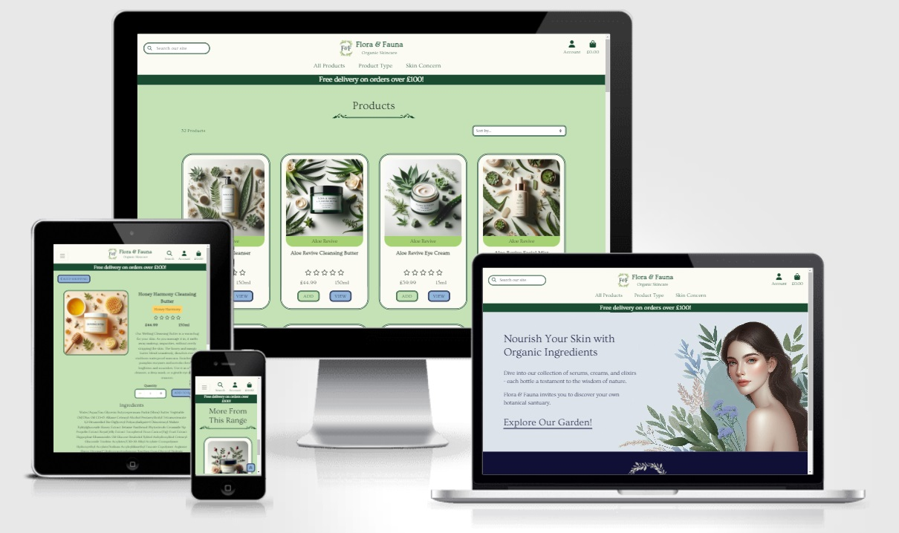

# **Flora & Fauna - Testing** <!-- omit in toc -->

## **Introduction** <!-- omit in toc -->

Welcome to the testing documentation for the Flora & Fauna e-commerce website. This document outlines the testing strategy and practices used to ensure the quality and reliability of the application.

The types of tests performed include automated testing using Django's built-in test suite. Code validation to ensure that the HTML, CSS, JavaScript, and Python code adhere to best practices and standards. Colour contrast checks to verify that the text is easily readable and meets accessibility standards. Additionally, site performance is assessed using Lighthouse testing, and thorough manual tests are conducted to identify and rectify any issues.

The goal of this approach is to deliver the highest quality website achievable within my capabilities.

[The full README is available here.](README.md)

[Click here to visit Flora & Fauna](https://flora-and-fauna-c279c1bad929.herokuapp.com/)

**By [Andrew Wright](https://github.com/AndyWright360)**

---

## **Contents** <!-- omit in toc --> 

- [**Automated Testing**](#automated-testing)
  - [**Django Testing**](#django-testing)
  - [**Code Validation**](#code-validation)
    - [**W3C HTML Validation**](#w3c-html-validation)
    - [**W3C CSS Validation**](#w3c-css-validation)
    - [**JSHint JavaScript Validation**](#jshint-javascript-validation)
    - [**Python Validation**](#python-validation)
  - [**WCAG Colour Contrast Checker**](#wcag-colour-contrast-checker)
  - [**Lighthouse Testing**](#lighthouse-testing)
- [**Manual Testing**](#manual-testing)
  - [**Testing User Stories**](#testing-user-stories)
  - [**Full Testing**](#full-testing)
  - [**Bugs & Fixes**](#bugs--fixes)
  - [**Known Bugs**](#known-bugs)

---

## **Automated Testing**

### **Django Testing**

This project marked my first experience with automated testing. As a beginner, I kept the tests straightforward to better understand this approach. I achieved 83% coverage across all apps, which I was pleased with given my experience level. The remaining testing was conducted manually.

I aimed to follow a test-driven development (TDD) approach, writing automated tests or manually checking the site functionality after adding new features. This experience highlighted the benefits of automated testing and improved my understanding of the process.

**Django Test Results**

**Total Test Coverage Results**

**Test Coverage Results Per App**

Home App

Products App

Bag App

Checkout App

Profiles App

Reviews App

Wishlist App

---

#### **W3C HTML Validation**

[W3C](https://validator.w3.org/) was used to validate the HTML code.

| Page | Results |
| :--- | :--- |
| index.html |  |
| products.html |  |
| product_detail.html |  |
| bag.html |  |
| checkout.html |  |
| checkout_success.html |  |
| profile.html |  |
| add_review.html |  |
| edit_review.html |  |
| add_product.html |  |
| edit_product.html |  |

I encountered several warnings while validating my HTML. These included missing `alt` tags for images, `
` elements nested within `` elements, and duplicate `id` tags within the same document. Additionally, there were a few other minor issues that needed correction. Once these problems were addressed, all pages passed validation without any issues.

#### **W3C CSS Validation**

[W3C](https://jigsaw.w3.org/css-validator/) was used to validate the CSS code.

| Page | Results |
| :--- | :--- |
| base.css |  |
| checkout.css |  |

The following warnings were flagged, all related to the use of vendor extensions, which I opted to disregard. I also replaced the deprecated `clip` property with the more commonly used `clip-path`.

#### **JSHint JavaScript Validation**

[JSHint](https://jshint.com/) was used to validate the JavaScript code.

| Page | Results |
| :--- | :--- |
| Quantity Input Script |  |
| Update Bag Script |  |
| New Image Script |  |
| Return To Top Button Script |  |
| Wishlist Toast Script |  |
| Add/Remove Wishlist Item Script |  |
| Product Rage Tooltip Script |  |
| Product Sort Script |  |
| Profile Form Update Script |  |
| Product Review Rating Script |  |
| stripe_elements.js |  |

The only warnings found during JavaScript linting were missing semi-colons. After addressing these, all scripts passed without any issues

#### **Python Validation**

[Code Institute Python Linter](https://pep8ci.herokuapp.com/) was used to validate the Python code.

Main Directory

| Page | Results |
| :--- | :--- |
| `Main` |
| custom_storages.py |  |
| manage.py |  |

Project Directory

| Page | Results |
| :--- | :--- |
| `Flora_and_Fauna` |
| asgi.py |  |
| sttings.py |  |
| urls.py |  |
| wsgi.py |  |

Home App Directory

| Page | Results |
| :--- | :--- |
| `Home` |
| apps.py |  |
| test_views.py |  |
| urls.py |  |
| views.py |  |

Products App Directory

| Page | Results |
| :--- | :--- |
| `Products` |
| admin.py |  |
| apps.py |  |
| forms.py |  |
| models.py |  |
| test_forms.py |  |
| test_models.py |  |
| test_views.py |  |
| urls.py |  |
| views.py |  |
| widgets.py |  |

Bag App Directory

| Page | Results |
| :--- | :--- |
| `Bag` |
| bag_tools.py |  |
| apps.py |  |
| contexts.py |  |
| test_views.py |  |
| urls.py |  |
| views.py |  |

Checkout App Directory

| Page | Results |
| :--- | :--- |
| `Checkout` |
| admin.py |  |
| apps.py |  |
| forms.py |  |
| models.py |  |
| signals.py |  |
| test_forms.py |  |
| test_models.py |  |
| test_views.py |  |
| urls.py |  |
| views.py |  |
| webhook_handler.py |  |
| webhooks.py |  |

Profiles App Directory

| Page | Results |
| :--- | :--- |
| `Profiles` |
| apps.py |  |
| forms.py |  |
| models.py |  |
| test_forms.py |  |
| test_models.py |  |
| test_views.py |  |
| urls.py |  |
| views.py |  |

Reviews App Directory

| Page | Results |
| :--- | :--- |
| `Reviews` |
| admin.py |  |
| apps.py |  |
| forms.py |  |
| models.py |  |
| test_forms.py |  |
| test_models.py |  |
| test_views.py |  |
| urls.py |  |
| views.py |  |

Wishlist App Directory

| Page | Results |
| :--- | :--- |
| `Wishlist` |
| admin.py |  |
| apps.py |  |
| models.py |  |
| test_models.py |  |
| test_views.py |  |
| urls.py |  |
| views.py |  |

 
I needed to make several adjustments to align my code with PEP8 standards. These changes mainly involved reformatting, such as shortening line lengths and eliminating excess white space. Once these modifications were applied, all pages passed without error.

---

### **WCAG Colour Contrast Checker**

A significant effort was made to create a strong contrast in the website's colour scheme. When selecting the primary colours for the site, I ensured that the complementary colours used for the text would also maintain clarity to enhance the user experience.

**Navbar**

The chosen colour scheme serves as the primary theme for the navbar. A high contrast was selected to ensure users have maximum clarity when navigating the site and utilising the various product filtering features.

**Buttons**

The green contrast acts as one of the primary button colours for the site and as the main colour scheme throughout. The blue colour scheme serves as an alternative styling option, while the red button is used specifically for delete options in user reviews and modals.

**Input Fields**

The colour scheme for input fields was chosen for its high contrast to ensure readability and clarity when users input details on the site.

**Product Range Links**

Each product range is represented by a colour associated with its key ingredient. I ensured the contrast was high enough to be legible while effectively communicating the desired colour scheme.

**Footer**

The footer's colour scheme was selected to be distinct while maintaining consistency with the rest of the site. Similar to the navbar, a high contrast was prioritised to ensure it stands out clearly.

---
